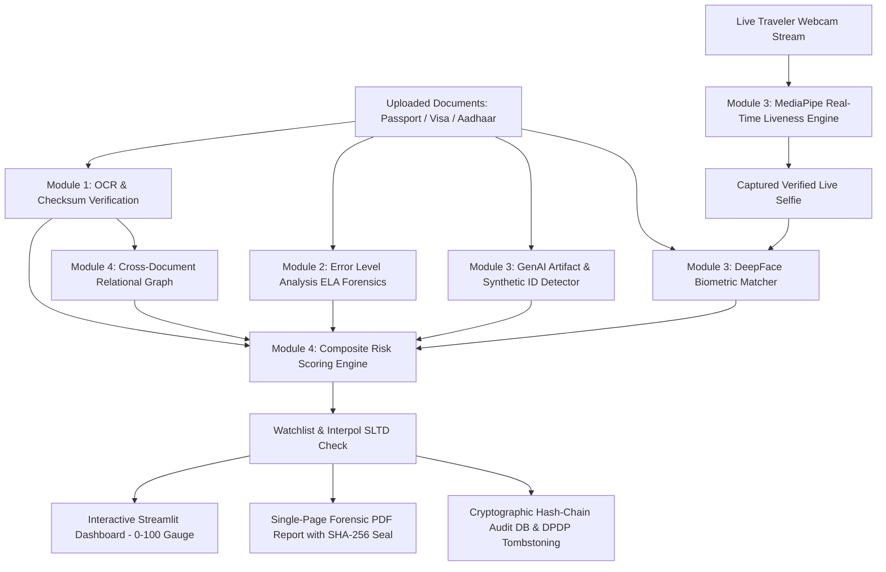

# AEIS — Border Screening System

> **Multi-Layer Forensic & Biometric Screening System**
> Built for **Prelims SIH 2026 – JECRC HackQuest 9.0** (5th–6th September 2026) | JECRC Campus, Jaipur.


---

## 👥 Team Async Anomaly (SIH 2026 Prelims)

| Name | Role / Specialization | Contact |
|---|---|---|
| **Anshul Agarwal** | Core System Architecture & Frontend Engineering | `anshulagarwal3034@gmail.com` |
| **Akshay Singh** | Backend Pipeline & Services Integration | `akshay7708209@gmail.com` |
| **Akshat Kumar Ojha** | Identity Verification & Core Forensic Modules | `akshatojha414@gmail.com` |
| **Sahil Raj** | Data Engineering & Infrastructure | `sahilraj.cse28@jecrc.ac.in` |
| **Mukti Jain** | Forensic Research & Compliance Analysis | `mukti.z.zen@gmail.com` |
| **Shruti Shukla** | Threat Research & Solution Design | `shrutitt2025@gmail.com` |

> This repository is my personal copy of our team's SIH prototype, kept to showcase the modules I built. Full team credit above — original repo linked at the bottom.

---

## 🙋 My Contribution

- **Module owned:** Compliance & audit endpoints (DPDP compliance, forensic report export, audit-log hash-chain validation)
- **What I built:** [briefly describe what these endpoints do and how you implemented them]

- **Problems solved:** [e.g. designed the cryptographic tombstone system for expired PII, or the hash-chain audit trail]

```bash
python -m uvicorn orchestration_platform.server.main:app --port 8000 --reload
cd frontend
npm run dev
```

# AI-Powered Border Checkpoint Document Fraud Screening & Identity Verification Platform

Developed for **Smart India Hackathon (SIH)**.

An enterprise-grade, multi-layer document forensics and biometric identity verification platform designed for automated border checkpoint identity screening. The system inspects **Passports (TD3)**, **Visas (TD2)**, and **Indian Aadhaar Cards**, detecting physical and digital tampering, generative AI synthetic documents, deepfakes, and presentation attacks (PAD). It enforces mathematical checksum verification, zero-disk privacy persistence, tamper-evident cryptographic audit trails, cross-document relational consistency graphs, and Human-in-the-Loop (HITL) officer governance.

---

## 🏛 System Architecture & End-to-End Pipeline



---

## 🛡️ Core Modules & Capabilities

### 🔹 Module 1: Foundational OCR, Checksum Engines & Governance
* **Mathematical Checksum Engines (From Scratch)**:
  * **ICAO Doc 9303 Modulo-10 (`core/mrz_utils.py`)**: Computes $[7,3,1]$ cyclic weights on document numbers, dates of birth, expiry dates, and composite master check digits.
  * **Verhoeff Dihedral Group $D_5$ Algorithm (`core/aadhaar_parser.py`)**: Executes non-commutative permutation and multiplication checks on 12-digit Aadhaar numbers ($100\%$ detection of single-digit transcription errors and adjacent transpositions).
* **VIZ vs. MRZ Forensic Cross-Check (`core/cross_validator.py`)**: Fuzzy Levenshtein sequence matching between Visual Inspection Zone and Machine Readable Zone catching selective Photoshop alterations.
* **UIDAI Privacy & Zero-Disk Persistence (`vision/redaction_engine.py`)**: Automated OpenCV bounding-box black-rectangle redaction over first 8 Aadhaar digits. Raw PII remains strictly in volatile RAM.
* **Tamper-Evident Cryptographic Hash Chain (`governance/audit_logger.py`)**: Append-only SQLite store where each block binds the previous SHA-256 hash ($\text{PrevHash}_{N-1}$).
* **DPDP Act 2023 Auto-Purge & Tombstoning (`governance/retention_engine.py`)**: Dual-tier retention strategy automatically purges clean traveler PII while preserving $100\%$ valid cryptographic hash chain linkage.

---

### 🔹 Module 2: Error Level Analysis (ELA) & Image Forensics
* **JPEG 8x8 DCT Compression Forensics (`orchestration_platform/wrappers/ela_adapter.py`)**: Recompresses document images at configurable quality levels ($70\% - 95\%$) and computes per-pixel error differentials.
* **Tamper Heatmap Generation**: High-frequency spatial discontinuities pinpoint spliced photos, altered text fields, and digitally cloned seals.

---

### 🔹 Module 3: Generative AI Detection, Biometrics & Real-Time Liveness (Person C)
* **Generative AI & Synthetic Document Detector (`ai_vision/ai_detector.py`)**:
  * **Vision Transformer (ViT)**: Pretrained `Ateeqq/ai-vs-human-image-detector` detecting latent diffusion smoothing and synthetic upsampling artifacts.
  * **Spatial Noise Uniformity Heuristic**: 1st-order Laplacian differences ($\sigma_{\text{spatial}}$) detecting unnaturally smooth synthetic gradients vs. real paper fiber/ink noise.
  * **Ensemble Fusion**: $85\%$ ViT + $15\%$ Noise score with calibrated three-tier verdict (`AI_GENERATED` / `SUSPICIOUS_REVIEW` / `LIKELY_REAL`).
* **DeepFace Biometric Identity Matcher (`ai_vision/face_verify.py`)**:
  * Cross-domain verification matching 10-year-old passport engravings against ambient selfies using **RetinaFace** alignment and **Facenet / ArcFace** cosine distance embeddings ($d < 0.40$).
* **Real-Time Presentation Attack Detection (PAD / Liveness) (`ai_vision/liveness_detector.py`)**:
  * **MediaPipe 468-Point Mesh**: CPU/XNNPACK-accelerated landmark tracking.
  * **Soukupová-Čech Eye Aspect Ratio (EAR)**: 6-point vector metric with **Adaptive Baseline Calibration** ($25\%$ relative drop threshold).
  * **Live In-Screen 30 FPS HUD**: Dynamic EAR meter bar, live blink counter (`Blinks: X / 2`), and real-time status badges.
  * **10-Second Anti-Spoofing Deadline**: Automatically catches static 2D photo print attacks or screen video replays when no natural blinks occur within 10 seconds.

---

### 🔹 Module 4: Orchestration Platform, Relational Graph & Decision Engine
* **Interactive Streamlit Dashboard (`orchestration_platform/app.py`)**:
  * Plotly 0–100 Composite Risk Gauge Dial with color-coded operational verdicts (`ACCEPT`, `MANUAL_REVIEW`, `REJECT`).
  * Live In-Page Webcam Scanner with real-time countdown progress bar.
* **Cross-Document Relational Consistency Graph (`orchestration_platform/engine/cross_doc_graph.py`)**:
  * Graph alignment engine cross-referencing demographic attributes (Name, DOB, Gender) across multiple submitted documents (Passport + Visa + Aadhaar).
* **Investigation-Ready Single-Page Forensic PDF Report (`reports/forensic_generator.py`)**:
  * Generates vector PDF with cryptographic SHA-256 seals, Modulo-10 mathematical proofs, ELA indicators, and physical officer sign-off sections.

---

## 📁 Repository Structure

AI-document-screening/
│
├── core/ # Module 1: Forensic Validation & Checksum Engines
│ ├── mrz_utils.py # ICAO 9303 Modulo-10 cyclic check digit engine
│ ├── td3_parser.py # Passport TD3 parser (2x44) & composite validation
│ ├── td2_parser.py # Visa TD2 parser (2x36) & composite validation
│ ├── aadhaar_parser.py # Aadhaar QR/OCR parser, Verhoeff D_5 engine & UID masking
│ ├── cross_validator.py # VIZ-to-MRZ fuzzy cross-zone anti-tampering engine
│ ├── field_validator.py # Expiry, DOB sanity, century resolution, ISO-3166 codes
│ └── blacklist_check.py # Interpol SLTD & sanctions mock database
│
├── vision/ # Module 1: Computer Vision & Redaction
│ ├── ocr_engine.py # Multi-scale ROI cropping, Black-Hat filtering & OCR
│ └── redaction_engine.py # OpenCV bounding-box UIDAI redactor & Base64 encoder
│
├── ai_vision/ # Module 3: AI Detection, Biometrics & Liveness (Person C)
│ ├── ai_detector.py # ViT transformer + Laplacian noise uniformity ensemble
│ ├── face_verify.py # DeepFace (Facenet / RetinaFace) biometric verification
│ ├── liveness_detector.py # MediaPipe EAR blink engine, 10s PAD timer & HUD overlay
│ ├── main.py # FastAPI microservice for AI Vision & Biometrics
│ ├── models/ # Cached MediaPipe FaceLandmarker model assets
│ └── requirements.txt # AI Vision dependencies
│
├── orchestration_platform/ # Module 4: Dashboard, Graph & Multi-Layer Engine
│ ├── app.py # Interactive Streamlit screening dashboard
│ ├── engine/
│ │ ├── composite_risk_engine.py # Multi-layer weighted risk scoring engine (0-100)
│ │ └── cross_doc_graph.py # Relational consistency identity graph
│ └── wrappers/
│ ├── ai_vision_adapter.py # Wrapper for Person C AI vision & in-screen liveness
│ ├── ela_adapter.py # Wrapper for Module 2 Error Level Analysis
│ └── ocr_adapter.py # Wrapper for Module 1 OCR & checksum parsing
│
├── governance/ # Module 1: Audit Logging & DPDP Compliance
│ ├── audit_logger.py # SQLite append-only audit trail & SHA-256 hash-chain
│ └── retention_engine.py # DPDP Act 2023 data minimization & tombstoning
│
├── reports/ # Evidentiary Documentation
│ └── forensic_generator.py # ReportLab single-page PDF generator with SHA-256 seal
│
├── api/ # API Data Contracts
│ └── schemas.py # Pydantic v2 validation models
│
├── main.py # Root FastAPI microservice & 9-stage CLI demonstration
├── run_dashboard.py # Streamlit Dashboard launcher script
├── test_suite.py # 33 automated regression tests (100% pass rate)
├── test_liveness.py # 5 automated tests for EAR math & blink state machine
├── requirements.txt # Root platform dependencies
└── README.md


---

## 🚀 Quickstart & Execution Guide

### 1. Install Dependencies
```bash
pip install -r requirements.txt
pip install -r ai_vision/requirements.txt
```

### 2. Launch the Interactive Streamlit Dashboard (Recommended)
```bash
python run_dashboard.py
```
*Or directly:*
```bash
streamlit run orchestration_platform/app.py
```
Open **`http://localhost:8501`** in your browser.

---

### 3. Run the Automated Test Suites

#### A. Full Platform Integration Test Suite (33 Tests)
```bash
python test_suite.py
```
*Verifies ICAO 9303 check digits, Verhoeff $D_5$ group math, VIZ-MRZ cross-matching, cryptographic hash chains, and DPDP Act data minimization.*

#### B. Real-Time Liveness & EAR Unit Tests (5 Tests)
```bash
python test_liveness.py
```
*Verifies mathematical EAR precision, MediaPipe model integrity, blink state machine transitions, and HUD overlays.*

---

### 4. Run Standalone Demonstrations

#### Standalone 9-Stage Platform CLI Demo:
```bash
python main.py
```

#### Standalone Live Webcam Liveness HUD Scanner:
```bash
python ai_vision/liveness_detector.py
```

#### Launch Root FastAPI Microservice:
```bash
uvicorn main:app --reload --host 0.0.0.0 --port 8000
```
Interactive Swagger API documentation: `http://localhost:8000/docs`.

---

## 📡 API Endpoints Summary

### Platform Core API (`main.py`)

| Method | Endpoint | Description |
| :--- | :--- | :--- |
| `POST` | `/validate-document` | Upload document image $\to$ Full structured JSON verification |
| `POST` | `/validate-and-export-report` | 1-Click Upload $\to$ Vision extraction + Instant PDF download |
| `POST` | `/export-forensic-report` | Generates SHA-256 sealed Forensic PDF Report from JSON |
| `POST` | `/validate-mrz-text` | Directly validates raw 2-line MRZ string (TD3 / TD2) |
| `POST` | `/validate-aadhaar-text` | Validates raw Aadhaar XML QR or 12-digit UID string |
| `POST` | `/submit-officer-decision`| Records officer verdict & enforces override reason codes |
| `GET` | `/audit-logs/verify-chain` | Cryptographically validates full hash-chain from Genesis #0 to latest block |
| `POST` | `/compliance/purge-expired`| Automatically purges expired clean PII with cryptographic tombstones |
| `GET` | `/compliance/dpdp-status` | Real-time DPDP data minimization metrics & statutory hold counters |

### AI Vision & Biometrics API (`ai_vision/main.py`)

| Method | Endpoint | Description |
| :--- | :--- | :--- |
| `POST` | `/verify` | Compares document portrait vs selfie + checks for AI generation |
| `POST` | `/liveness/check-frame` | Evaluates single frame for face presence & Eye Aspect Ratio (EAR) |
| `POST` | `/liveness/trigger-webcam`| Launches interactive local 30 FPS webcam HUD liveness session |

---

## 📜 Regulatory Standards & Statutory Compliance

- **ICAO Doc 9303 (Parts 3, 4, 7)**: Machine Readable Travel Documents specification ($[7,3,1]$ cyclic check digits).
- **ISO/IEC 30107-3**: Biometric Presentation Attack Detection (PAD) standards for anti-spoofing and liveness.
- **Aadhaar Act 2016 Section 29**: Prohibition on raw UID storage and display.
- **UIDAI Circular Comp/01/2018 & RBI Master Directions**: Mandatory masking of the first 8 Aadhaar digits.
- **Digital Personal Data Protection (DPDP) Act 2023 Section 8(7)**: Mandatory data minimization and storage limitation for clean travelers.
- **Digital Personal Data Protection (DPDP) Act 2023 Section 17(1)(c)**: Exemption for prevention and detection of offences (evidentiary holds).

## 🔗 Original Team Repository

[AkshaySingh198/AI-document-screening](https://github.com/AkshaySingh198/AI-document-screening)
