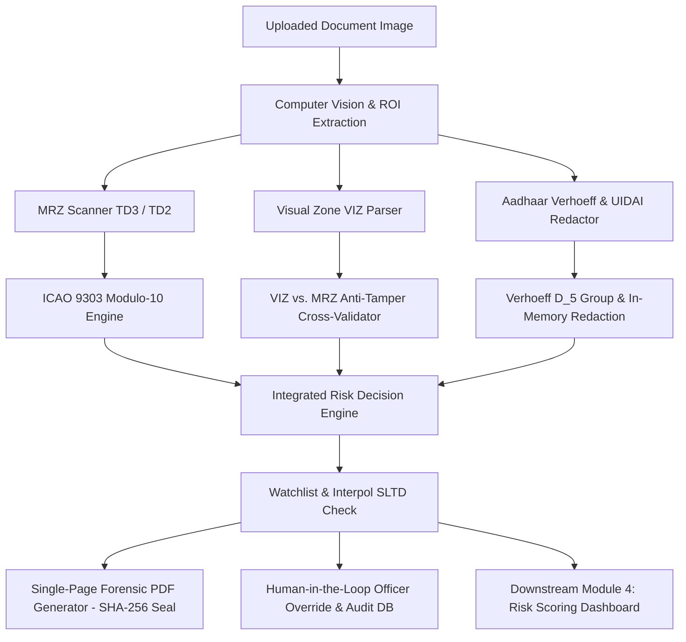

# AI Border Checkpoint Document Screening & Verification Engine
## Module 1: Automated OCR, Multi-Zone Forensic Cross-Check, ICAO 9303 / Verhoeff Checksum Verification, UIDAI Privacy Redaction & Officer Governance

Developed for **Smart India Hackathon (SIH)**.

This module is the foundational data ingestion, verification, and governance engine in a 4-stage pipeline for automated border checkpoint identity screening. It processes **Passports (TD3)**, **Visas (TD2)**, and **Indian Aadhaar Cards**, mathematically verifying optical identity fields, executing cross-zone anti-tampering forensics, guaranteeing UIDAI legal privacy compliance with zero-disk persistence, generating single-page evidentiary PDF reports with SHA-256 seals, and enforcing Human-in-the-Loop (HITL) officer accountability logging.

---

## 🏛 System Architecture & Pipeline



---

## 🛡️ Key Features & Technical Capabilities

### 1. Mathematical Checksum Engines (From Scratch)
- **ICAO Doc 9303 Modulo-10 (`core/mrz_utils.py`)**: Computes $[7,3,1]$ cyclic weights on document numbers, dates of birth, expiry dates, and composite master check digits.
- **Verhoeff Dihedral Group $D_5$ Algorithm (`core/aadhaar_parser.py`)**: Executes non-commutative permutation and multiplication checks on 12-digit Aadhaar numbers ($100\%$ detection of single-digit transcription errors and adjacent transpositions).

### 2. VIZ vs. MRZ Forensic Cross-Check Engine (`core/cross_validator.py`)
- Standardizes multilingual dates (`01 JANI JAN 98` $\to$ `1998-01-01`).
- Runs fuzzy Levenshtein sequence matching between Visual Inspection Zone (top 70%) and Machine Readable Zone (bottom 30%) to catch selective Photoshop name/DOB alterations (`VIZ_MRZ_NAME_MISMATCH`, `VIZ_MRZ_DOB_MISMATCH`).

### 3. UIDAI Legal Compliance & Zero-Disk Persistence (`vision/redaction_engine.py`)
- Strictly adheres to **Aadhaar Act 2016 Section 29**, **UIDAI Circular Comp/01/2018**, and **RBI KYC Master Directions**.
- Applies automated OpenCV bounding-box black-rectangle redaction over the first 8 digits.
- **Zero-Disk Persistence Architecture**: Raw un-redacted images and full UIDs exist strictly in volatile RAM and are never written to disk or server logs.

### 4. Investigation-Ready Forensic Report Export (`reports/forensic_generator.py`)
- Generates a vector-rendered, single-page evidentiary documentation PDF.
- Binds all validation outcomes into a cryptographic **SHA-256 Digital Fingerprint** printed on the header, body, and footer for tamper-evident digital trail audits.
- Includes color-coded decision banners (🟢 `CLEARED`, 🟡 `SECONDARY INSPECTION`, 🔴 `DETAIN`), step-by-step Modulo-10 mathematical proofs, and physical officer sign-off lines.

### 5. Officer Override & Human-in-the-Loop Governance (`governance/audit_logger.py`)
- Captures when a human officer overrides the AI recommendation (e.g. approving a glare-flagged document after manual UV lamp check, or detaining a clean document due to behavioral suspicion).
- Mandates standardized regulatory reason codes (`OPTICAL_GLARE_FALSE_POSITIVE`, `DIPLOMATIC_CONSULAR_IMMUNITY`, `BEHAVIORAL_ANOMALY_SUSPICION`, etc.).
- Enforces supervisor co-signatures for critical `DETAIN` overrides and persists records into an append-only SQLite store (`data/audit_log.db`).

---

## 📁 Repository Structure

```
AI-document-screening/
│
├── core/
│   ├── __init__.py
│   ├── mrz_utils.py        # Pure-Python ICAO 9303 Modulo-10 cyclic check digit engine
│   ├── td3_parser.py       # Passport TD3 parser (2x44) & composite validation
│   ├── td2_parser.py       # Visa TD2 parser (2x36) & composite validation
│   ├── aadhaar_parser.py   # Aadhaar QR/OCR parser, Verhoeff D_5 engine & UID masking
│   ├── cross_validator.py  # VIZ-to-MRZ fuzzy cross-zone anti-tampering engine
│   ├── field_validator.py  # Expiry, DOB sanity, century resolution, ISO-3166 codes
│   └── blacklist_check.py  # Watchlist screening (Interpol SLTD, sanctions mock database)
│
├── vision/
│   ├── __init__.py
│   ├── ocr_engine.py       # Multi-scale ROI cropping, Black-Hat filtering & OCR pipeline
│   └── redaction_engine.py # OpenCV bounding-box black-box redactor & Base64 encoder
│
├── reports/
│   ├── __init__.py
│   └── forensic_generator.py # ReportLab single-page PDF generator with SHA-256 seal
│
├── governance/
│   ├── __init__.py
│   └── audit_logger.py     # SQLite append-only audit trail & governance metrics engine
│
├── api/
│   ├── __init__.py
│   └── schemas.py          # Pydantic v2 data contracts and API models
│
├── data/
│   └── .gitkeep            # Data directory for local audit logs
│
├── main.py                 # FastAPI microservice & 7-stage standalone CLI test suite
├── test_suite.py           # 26 automated unit & integration tests (100% pass rate)
├── requirements.txt        # Python dependencies
├── .gitignore              # Ignored files (pycache, runtime DBs, test PDFs)
└── README.md
```

---

## 🚀 Quickstart & Standalone Testing

### 1. Install Dependencies
```bash
pip install -r requirements.txt
```

### 2. Run the Full Automated Test Suite (26 Tests)
```bash
python test_suite.py
```

### 3. Run the Standalone 7-Stage Demonstration Suite
```bash
python main.py
```
Executes complete automated validation pipelines:
1. Valid TD3 Specimen Passport (caught on Interpol SLTD blacklist).
2. Deliberately Tampered & Expired Passport (caught for broken Modulo-10 checksum + expiry).
3. Valid TD2 Visa.
4. Valid Aadhaar Card with Verhoeff calculation & UIDAI masking.
5. VIZ vs. MRZ Photoshop Tampering Detection.
6. Investigation-Ready Single-Page Forensic PDF Report Generation with SHA-256 Seal.
7. Human Officer Override & Accountability Logging with Supervisor Co-Sign.

### 4. Launch the FastAPI Microservice
```bash
uvicorn main:app --reload --host 0.0.0.0 --port 8000
```
Interactive Swagger API documentation: `http://localhost:8000/docs`.

---

## 📡 API Endpoints Summary

| Method | Endpoint | Description |
| :--- | :--- | :--- |
| `POST` | `/validate-document` | Upload document image (Passport/Visa/Aadhaar) $\to$ Full structured JSON verification |
| `POST` | `/validate-and-export-report` | 1-Click Upload $\to$ Vision extraction + Instant single-page Forensic PDF download |
| `POST` | `/export-forensic-report` | Generates SHA-256 sealed Forensic PDF Report from JSON validation payload |
| `POST` | `/validate-mrz-text` | Directly validates raw 2-line MRZ string (TD3 / TD2) |
| `POST` | `/validate-aadhaar-text` | Validates raw Aadhaar XML QR or 12-digit UID string |
| `POST` | `/submit-officer-decision`| Records officer verdict, enforces override reason codes & logs to audit DB |
| `GET` | `/override-reasons` | Returns standardized regulatory reason codes for UI dropdowns |
| `GET` | `/audit-logs` | Retrieves paginated immutable audit logs for inquiry commissions |
| `GET` | `/audit-logs/stats` | Governance metrics (Override Rate %, Agreement %, Reason Breakdown) |
| `GET` | `/blacklist` | Inspects active simulated border watchlists |
| `GET` | `/health` | Service health status |

---

## 📜 Regulatory Standards & Legal Compliance

- **ICAO Doc 9303 (Parts 3, 4, 7)**: Machine Readable Travel Documents specification.
- **Aadhaar Act 2016 Section 29**: Prohibition on raw UID storage and display.
- **UIDAI Circular Comp/01/2018 & RBI Master Directions**: Mandatory masking of the first 8 digits.
